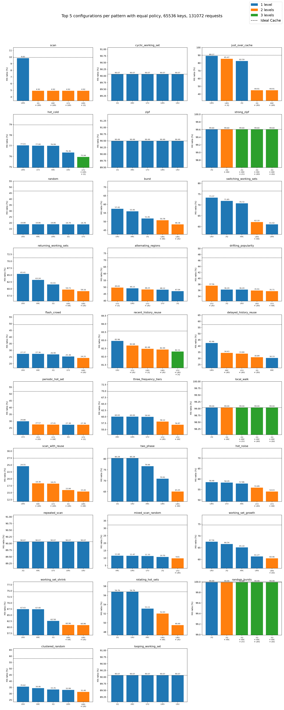
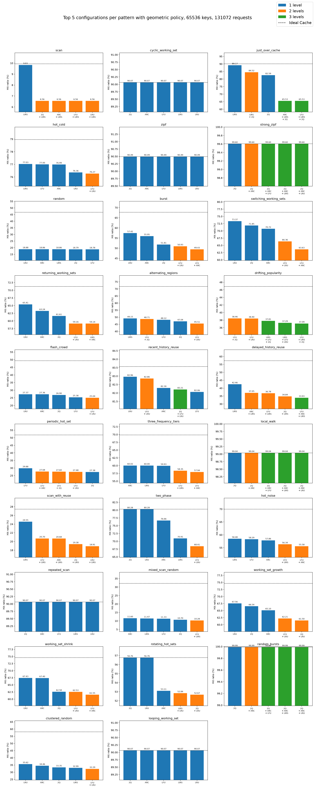

# More requests than keys

In this benchmark requests count is higher than keys one.

```shell
uv run main.py \
    --cache-size=13020 \
    --keys=65536 \
    --requests=131072 \
    --seed=42 \
    --levels=3
```

# Policy: equal

| Pattern                | Best Configuration      |   Best Hit (%) |   Best Diff Ideal (%) | Single Algorithm        |   Single Hit (%) |   Single Diff Ideal (%) | Multi Algorithm                                                                              |   Multi Hit (%) |   Multi Diff Ideal (%) |
|:-----------------------|:------------------------|---------------:|----------------------:|:------------------------|-----------------:|------------------------:|:---------------------------------------------------------------------------------------------|----------------:|-----------------------:|
| scan                   | LIRS                    |           9.83 |                  0.10 | LIRS                    |             9.83 |                    0.10 | 2Q + LIRS, ARC + LIRS, LFU + LIRS, LIRS + 2Q, LIRS + ARC, LIRS + LFU, LIRS + LRU, LRU + LIRS |            4.92 |                   5.02 |
| cyclic_working_set     | 2Q, ARC, LFU, LIRS, LRU |          90.07 |                  0.00 | 2Q, ARC, LFU, LIRS, LRU |            90.07 |                    0.00 | LIRS + 2Q                                                                                    |           85.49 |                   4.58 |
| just_over_cache        | LIRS                    |          89.17 |                  0.89 | LIRS                    |            89.17 |                    0.89 | LIRS + 2Q                                                                                    |           85.47 |                   4.59 |
| hot_cold               | LIRS                    |          77.03 |                  1.93 | LIRS                    |            77.03 |                    1.93 | LFU + LIRS + 2Q                                                                              |           75.94 |                   3.02 |
| zipf                   | 2Q, ARC, LFU, LIRS, LRU |          90.49 |                  0.00 | 2Q, ARC, LFU, LIRS, LRU |            90.49 |                    0.00 | LRU + LIRS                                                                                   |           90.39 |                   0.11 |
| strong_zipf            | 2Q, ARC, LFU, LIRS, LRU |          99.60 |                  0.00 | 2Q, ARC, LFU, LIRS, LRU |            99.60 |                    0.00 | 80                                                                                           |           99.60 |                   0.00 |
| random                 | LRU                     |          18.88 |                 27.81 | LRU                     |            18.88 |                   27.81 | LFU + LIRS                                                                                   |           17.33 |                  29.36 |
| burst                  | LRU                     |          57.42 |                 10.26 | LRU                     |            57.42 |                   10.26 | LIRS + ARC                                                                                   |           50.78 |                  16.91 |
| switching_working_sets | LRU                     |          73.37 |                  3.04 | LRU                     |            73.37 |                    3.04 | LIRS + ARC                                                                                   |           62.10 |                  14.30 |
| returning_working_sets | LRU                     |          65.41 |                  5.80 | LRU                     |            65.41 |                    5.80 | LIRS + ARC                                                                                   |           59.73 |                  11.47 |
| alternating_regions    | LFU + 2Q                |          49.65 |                 22.00 | LIRS                    |            49.15 |                   22.50 | LFU + 2Q                                                                                     |           49.65 |                  22.00 |
| drifting_popularity    | LFU + LRU               |          37.56 |                  9.31 | 2Q, LRU                 |            36.24 |                   10.62 | LFU + LRU                                                                                    |           37.56 |                   9.31 |
| flash_crowd            | LRU                     |          27.37 |                 21.91 | LRU                     |            27.37 |                   21.91 | LIRS + LRU                                                                                   |           24.25 |                  25.02 |
| recent_history_reuse   | LRU                     |          82.96 |                  0.61 | LRU                     |            82.96 |                    0.61 | LFU + LRU                                                                                    |           82.68 |                   0.89 |
| delayed_history_reuse  | LIRS                    |          42.46 |                 14.83 | LIRS                    |            42.46 |                   14.83 | ARC + LIRS                                                                                   |           34.43 |                  22.86 |
| periodic_hot_set       | LFU                     |          29.88 |                 21.93 | LFU                     |            29.88 |                   21.93 | LFU + LRU                                                                                    |           27.57 |                  24.24 |
| three_frequency_tiers  | ARC                     |          60.02 |                  9.82 | ARC                     |            60.02 |                    9.82 | LFU + LIRS                                                                                   |           58.12 |                  11.72 |
| local_walk             | 2Q, ARC, LFU, LIRS, LRU |          99.04 |                  0.00 | 2Q, ARC, LFU, LIRS, LRU |            99.04 |                    0.00 | 80                                                                                           |           99.04 |                   0.00 |
| scan_with_reuse        | LIRS                    |          24.55 |                  2.87 | LIRS                    |            24.55 |                    2.87 | ARC + LIRS                                                                                   |           18.38 |                   9.04 |
| two_phase              | 2Q, LRU                 |          80.28 |                  0.00 | 2Q, LRU                 |            80.28 |                    0.00 | LIRS + ARC                                                                                   |           65.05 |                  15.23 |
| hot_noise              | LIRS                    |          58.48 |                 11.46 | LIRS                    |            58.48 |                   11.46 | LFU + LIRS                                                                                   |           55.89 |                  14.05 |
| repeated_scan          | 2Q, ARC, LFU, LIRS, LRU |          90.07 |                  0.00 | 2Q, ARC, LFU, LIRS, LRU |            90.07 |                    0.00 | LIRS + 2Q                                                                                    |           85.49 |                   4.58 |
| mixed_scan_random      | ARC                     |          11.60 |                 20.53 | ARC                     |            11.60 |                   20.53 | LFU + LIRS                                                                                   |            9.81 |                  22.32 |
| working_set_growth     | LRU                     |          67.56 |                  7.08 | LRU                     |            67.56 |                    7.08 | LIRS + LRU                                                                                   |           60.46 |                  14.18 |
| working_set_shrink     | LRU                     |          67.43 |                  7.15 | LRU                     |            67.43 |                    7.15 | LIRS + ARC                                                                                   |           60.96 |                  13.62 |
| rotating_hot_sets      | 2Q, LRU                 |          56.76 |                  0.00 | 2Q, LRU                 |            56.76 |                    0.00 | LIRS + ARC                                                                                   |           52.03 |                   4.73 |
| random_bursts          | 2Q, ARC, LFU, LIRS, LRU |          99.99 |                  0.00 | 2Q, ARC, LFU, LIRS, LRU |            99.99 |                    0.00 | 80                                                                                           |           99.99 |                   0.00 |
| clustered_random       | LRU                     |          35.62 |                 22.40 | LRU                     |            35.62 |                   22.40 | LIRS + LRU                                                                                   |           31.40 |                  26.62 |
| looping_working_set    | 2Q, ARC, LFU, LIRS, LRU |          90.07 |                  0.00 | 2Q, ARC, LFU, LIRS, LRU |            90.07 |                    0.00 | LFU + LIRS                                                                                   |           60.26 |                  29.80 |

<p align="center">
  
</p>

# Policy: geometric

| Pattern                | Best Configuration      |   Best Hit (%) |   Best Diff Ideal (%) | Single Algorithm        |   Single Hit (%) |   Single Diff Ideal (%) | Multi Algorithm                               |   Multi Hit (%) |   Multi Diff Ideal (%) |
|:-----------------------|:------------------------|---------------:|----------------------:|:------------------------|-----------------:|------------------------:|:----------------------------------------------|----------------:|-----------------------:|
| scan                   | LIRS                    |           9.83 |                  0.10 | LIRS                    |             9.83 |                    0.10 | 2Q + LIRS, ARC + LIRS, LFU + LIRS, LRU + LIRS |            6.56 |                   3.38 |
| cyclic_working_set     | 2Q, ARC, LFU, LIRS, LRU |          90.07 |                  0.00 | 2Q, ARC, LFU, LIRS, LRU |            90.07 |                    0.00 | LIRS + 2Q                                     |           84.53 |                   5.54 |
| just_over_cache        | LIRS                    |          89.17 |                  0.89 | LIRS                    |            89.17 |                    0.89 | LIRS + 2Q                                     |           84.52 |                   5.54 |
| hot_cold               | LIRS                    |          77.03 |                  1.93 | LIRS                    |            77.03 |                    1.93 | LFU + LRU                                     |           76.27 |                   2.69 |
| zipf                   | 2Q, ARC, LFU, LIRS, LRU |          90.49 |                  0.00 | 2Q, ARC, LFU, LIRS, LRU |            90.49 |                    0.00 | LRU + LIRS                                    |           90.42 |                   0.07 |
| strong_zipf            | 2Q, ARC, LFU, LIRS, LRU |          99.60 |                  0.00 | 2Q, ARC, LFU, LIRS, LRU |            99.60 |                    0.00 | 80                                            |           99.60 |                   0.00 |
| random                 | LRU                     |          18.88 |                 27.81 | LRU                     |            18.88 |                   27.81 | LFU + LIRS                                    |           17.48 |                  29.21 |
| burst                  | LRU                     |          57.42 |                 10.26 | LRU                     |            57.42 |                   10.26 | LFU + LRU                                     |           50.93 |                  16.76 |
| switching_working_sets | LRU                     |          73.37 |                  3.04 | LRU                     |            73.37 |                    3.04 | LFU + LRU                                     |           66.36 |                  10.04 |
| returning_working_sets | LRU                     |          65.41 |                  5.80 | LRU                     |            65.41 |                    5.80 | LFU + LRU                                     |           59.16 |                  12.05 |
| alternating_regions    | LIRS                    |          49.15 |                 22.50 | LIRS                    |            49.15 |                   22.50 | LFU + 2Q                                      |           48.71 |                  22.93 |
| drifting_popularity    | LFU + 2Q                |          38.46 |                  8.40 | 2Q, LRU                 |            36.24 |                   10.62 | LFU + 2Q                                      |           38.46 |                   8.40 |
| flash_crowd            | LRU                     |          27.37 |                 21.91 | LRU                     |            27.37 |                   21.91 | LFU + LRU                                     |           25.04 |                  24.24 |
| recent_history_reuse   | LRU                     |          82.96 |                  0.61 | LRU                     |            82.96 |                    0.61 | LFU + LRU                                     |           82.86 |                   0.71 |
| delayed_history_reuse  | LIRS                    |          42.46 |                 14.83 | LIRS                    |            42.46 |                   14.83 | ARC + LIRS                                    |           37.05 |                  20.24 |
| periodic_hot_set       | LFU                     |          29.88 |                 21.93 | LFU                     |            29.88 |                   21.93 | LFU + ARC                                     |           27.68 |                  24.13 |
| three_frequency_tiers  | ARC                     |          60.02 |                  9.82 | ARC                     |            60.02 |                    9.82 | LFU + LIRS                                    |           58.35 |                  11.50 |
| local_walk             | 2Q, ARC, LFU, LIRS, LRU |          99.04 |                  0.00 | 2Q, ARC, LFU, LIRS, LRU |            99.04 |                    0.00 | 80                                            |           99.04 |                   0.00 |
| scan_with_reuse        | LIRS                    |          24.55 |                  2.87 | LIRS                    |            24.55 |                    2.87 | LFU + LIRS                                    |           20.70 |                   6.72 |
| two_phase              | 2Q, LRU                 |          80.28 |                  0.00 | 2Q, LRU                 |            80.28 |                    0.00 | LFU + LRU                                     |           68.41 |                  11.86 |
| hot_noise              | LIRS                    |          58.48 |                 11.46 | LIRS                    |            58.48 |                   11.46 | LFU + LIRS                                    |           56.34 |                  13.60 |
| repeated_scan          | 2Q, ARC, LFU, LIRS, LRU |          90.07 |                  0.00 | 2Q, ARC, LFU, LIRS, LRU |            90.07 |                    0.00 | LIRS + 2Q                                     |           84.53 |                   5.54 |
| mixed_scan_random      | ARC                     |          11.60 |                 20.53 | ARC                     |            11.60 |                   20.53 | LFU + LIRS                                    |           10.28 |                  21.84 |
| working_set_growth     | LRU                     |          67.56 |                  7.08 | LRU                     |            67.56 |                    7.08 | LFU + LRU                                     |           62.21 |                  12.42 |
| working_set_shrink     | LRU                     |          67.43 |                  7.15 | LRU                     |            67.43 |                    7.15 | LFU + LRU                                     |           62.53 |                  12.05 |
| rotating_hot_sets      | 2Q, LRU                 |          56.76 |                  0.00 | 2Q, LRU                 |            56.76 |                    0.00 | LIRS + LRU                                    |           52.84 |                   3.92 |
| random_bursts          | 2Q, ARC, LFU, LIRS, LRU |          99.99 |                  0.00 | 2Q, ARC, LFU, LIRS, LRU |            99.99 |                    0.00 | 80                                            |           99.99 |                   0.00 |
| clustered_random       | LRU                     |          35.62 |                 22.40 | LRU                     |            35.62 |                   22.40 | LFU + LRU                                     |           32.29 |                  25.73 |
| looping_working_set    | 2Q, ARC, LFU, LIRS, LRU |          90.07 |                  0.00 | 2Q, ARC, LFU, LIRS, LRU |            90.07 |                    0.00 | 2Q + LIRS                                     |           61.86 |                  28.21 |

<p align="center">
  
</p>

